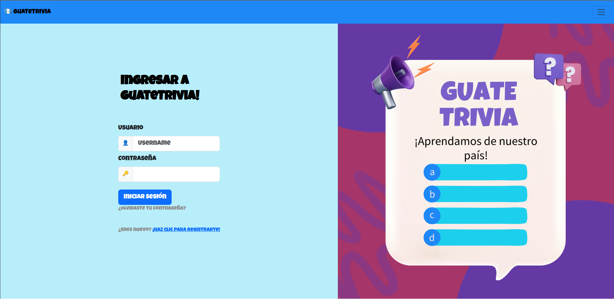
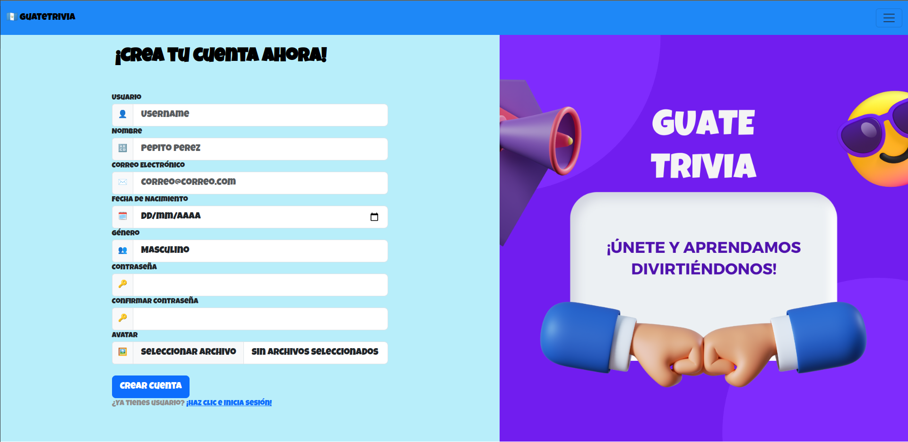
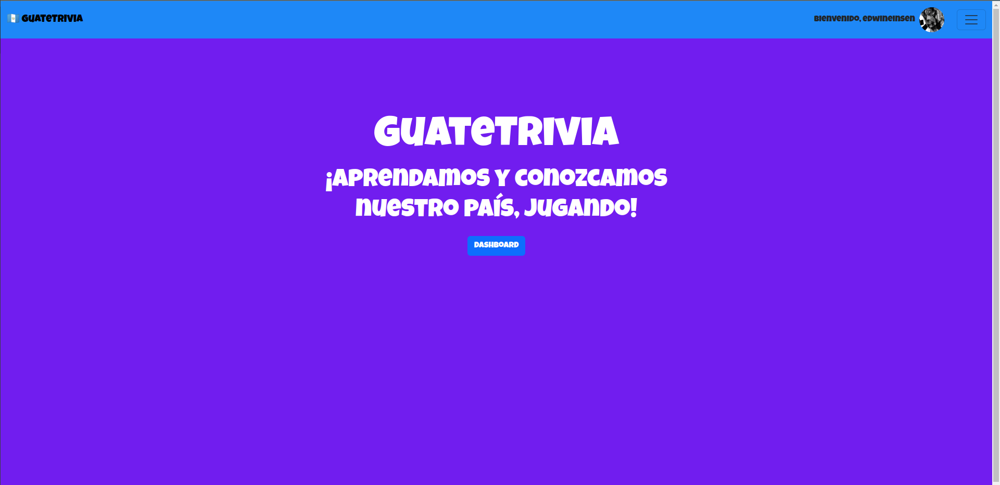
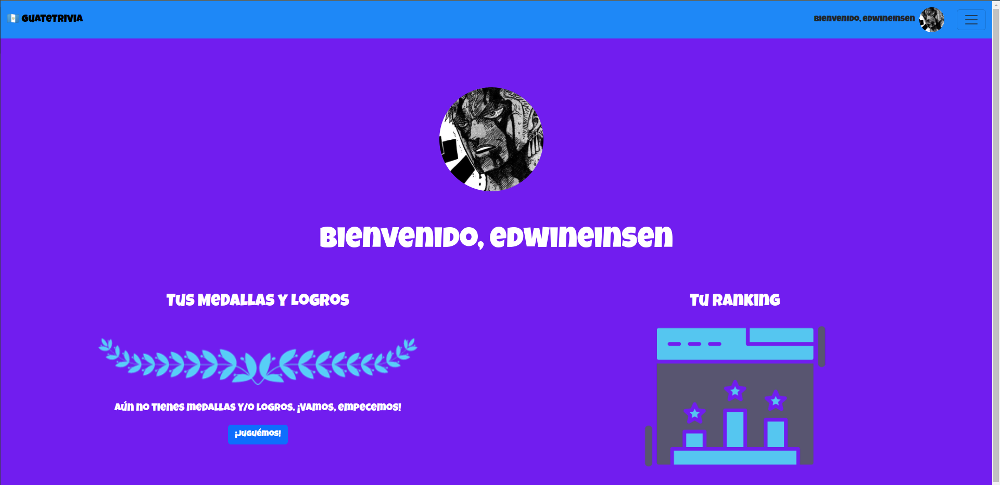
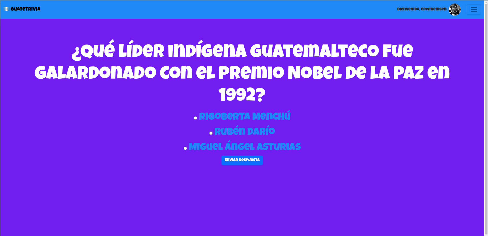

# GuateTrivia

GuateTrivia es una aplicación web educativa que permite a los usuarios aprender sobre Guatemala a través de juegos de trivia.

## Instalación

1. **Clona el Repositorio:**
   ```shell
   git clone https://github.com/tu_usuario/tu_proyecto.git
   cd tu_proyecto

2. **Configura el Entorno Virtual (opcional pero recomendado):**
   ```shell
   python -m venv venv
   source venv/bin/activate  # Para sistemas basados en Unix/Linux
   # o
   venv\Scripts\activate  # Para Windows

3. **Instala Dependencias:**
   ```shell
   pip install -r requirements.txt

4. **Configura la Base de Datos:**  
* Crea una base de datos SQLite (por defecto configurado en guatetrivia.db).
* Puedes configurar la conexión a la base de datos en app.py si prefieres usar una base de datos diferente.

5. **Inicia la Aplicación:**
   ```shell
   flask -A app.py run

## Uso

* Visita http://localhost:5000 en tu navegador para acceder a la aplicación.

## Funcionalidades

* __Inicio de Sesión y Registro__: Los usuarios pueden iniciar sesión o crear una cuenta para acceder a la aplicación.
* __Juegos de Trivia__: Juega juegos de trivia para aprender sobre Guatemala.
* __Dashboard Personalizado__: Los usuarios pueden ver su progreso y estadísticas en su dashboard personalizado.

## Capturas de Pantalla:
Login:


Registro:


Home:


Dashboard:


Trivia:



## Contribuir

Si deseas contribuir a GuateTrivia, sigue estos pasos:

1. Haz un fork del proyecto.
2. Crea una nueva rama (git checkout -b feature/nueva-caracteristica).
3. Realiza tus cambios y haz commit (git commit -m 'Agrega nueva característica').
4. Sube tus cambios al fork (git push origin feature/nueva-caracteristica).
5. Abre un Pull Request para que tus cambios sean revisados.


## Licencia
Este proyecto está bajo la Licencia MIT.
